<div align="center">


# 🚀 HireFlow HRMS

**AI-powered Human Resource Management System** — from hiring to payroll, in one beautiful claymorphic interface.

[](https://hireflow-ai-g3k7.onrender.com)
[](https://hireflow-ai-hqml.onrender.com/health)

</div>

---

## ✨ What is HireFlow?

HireFlow is a full-stack HRMS that handles the complete employee lifecycle — from the moment a candidate browses a job opening, through AI resume screening, interviews, hiring, onboarding, attendance, leave, payroll, and performance reviews.

Built with a claymorphism design system, Next.js 14 App Router, Node.js/Express REST API, and MongoDB Atlas.

---

## 🏗️ Architecture & Workflow

<div align="center">
  
</div>

The diagram above covers:
- **System architecture** — client/server split, third-party services (MongoDB, Cloudinary, Groq, Brevo)
- **User roles** — all 5 roles with portal paths and permission scope
- **Hiring workflow** — 7-step journey from job posted → hired → employee auto-created
- **Employee lifecycle** — onboarding → attendance → leave → payroll → performance
- **API surface** — all 16 route groups mapped to the Express server

---

## 🎯 Features

### 🤖 AI-Powered Recruitment
- **Bulk resume screening** — upload up to 20 PDFs at once; Groq + HuggingFace extract skills and score candidates 0–100 by job fit
- **AI job description generator** — streaming SSE, generates complete JDs from a job title
- **AI interviews** — browser-based voice interviews with Web Speech API transcription, per-answer Groq scoring, final skill scores
- **Hire flow automation** — marking a candidate as Hired auto-creates Employee record, Onboarding checklist, User account, and sends credential email

### 👥 Employee Management
- Complete employee directory with search, filter, department grouping
- Salary structure editor (Base + HRA + Allowances − Deductions)
- Document upload via Cloudinary, avatar management
- `firstname.lastname@hireflow.com` login identity generated on hire

### 📅 Attendance & Leave
- Clock in / clock out with daily records
- Configurable leave policies (Casual, Sick, Annual, Maternity, Paternity, Unpaid) — seeded automatically on first server start
- Leave application with balance validation and manager approval
- Email notifications via Brevo HTTP API

### 💰 Payroll
- One-click monthly payroll run
- Attendance-adjusted gross/net salary calculations
- Payslips emailed automatically
- Historical payslip viewer for employees

### 📊 Analytics & Performance
- Recruitment funnel charts
- Attendance trend graphs
- Payroll cost summaries by department
- Performance rating distributions and goal tracking

---

## 👤 User Roles

| Role | Portal | Key Permissions |
|------|--------|----------------|
| `management_admin` | `/dashboard` | Full access — all modules, user role management, payroll |
| `senior_manager` | `/manager` | Team attendance, leave approval, performance reviews (own team only) |
| `hr_recruiter` | `/recruiter` | Jobs, AI screening, pipeline, interviews, onboarding |
| `employee` | `/employee` | Own attendance, leave, payslips, performance, profile |
| `candidate` | `/candidate-portal` | Browse jobs, apply, track applications, take AI interview |

---

## 🔄 Hiring Flow

```
Candidate applies (resume upload — no login required)
        ↓
AI screens resume → score 0–100 via Groq + HuggingFace
        ↓
HR advances through pipeline:
Applied → Screened → Interview Scheduled → Interviewed → Offered → Hired
        ↓
AI interview room (voice, browser-based, scored per answer)
        ↓
On "Hired" — automatically:
  ✅ Employee record created
  ✅ User account created (firstname.lastname@hireflow.com)
  ✅ Temp password generated & bcrypt-hashed
  ✅ Onboarding checklist created
  ✅ Credentials email sent via Brevo API
```

---

## 🛠️ Tech Stack

**Frontend**
- Next.js 14 App Router + TypeScript
- Tailwind CSS (claymorphism design system)
- NextAuth v5 (JWT sessions + Google OAuth)
- Zustand, React Hook Form + Zod, Recharts, Sonner

**Backend**
- Node.js + Express + express-async-errors
- Mongoose ODM (14 models, 16 route files, 15 controllers)
- bcryptjs + jsonwebtoken
- Multer + pdf-parse, cookie-parser

**AI & Cloud**
- Groq (LLaMA 3.1 8B) — JD generation, answer evaluation, HR chatbot
- HuggingFace NER — skill extraction from resumes
- Cloudinary — resume/document storage (streamed via backend proxy)
- Brevo HTTP API — transactional emails
- MongoDB Atlas — database

---

## 🚀 Getting Started

### Prerequisites
Node.js 20+, MongoDB Atlas, Cloudinary, Groq API key, Brevo account, Google Cloud OAuth credentials

### Server
```bash
cd server
npm install
cp .env.example .env    # fill in your values
npm run dev             # http://localhost:5000
```

### Client
```bash
cd client
npm install
cp .env.local.example .env.local    # fill in your values
npm run dev                          # http://localhost:3000
```

---

## ⚙️ Environment Variables

### Client — `client/.env.local`

```env
NEXT_PUBLIC_API_URL=http://localhost:5000
AUTH_SECRET=<openssl rand -base64 32>
AUTH_URL=http://localhost:3000
NEXTAUTH_SECRET=<same as AUTH_SECRET>
NEXTAUTH_URL=http://localhost:3000
GOOGLE_CLIENT_ID=
GOOGLE_CLIENT_SECRET=
```

### Server — `server/.env`

```env
PORT=5000
MONGODB_URI=mongodb+srv://...
JWT_SECRET=<random secret>
CLIENT_URL=http://localhost:3000
NODE_ENV=development

CLOUDINARY_CLOUD_NAME=
CLOUDINARY_API_KEY=
CLOUDINARY_API_SECRET=

GROQ_API_KEY=
HUGGINGFACE_API_KEY=

BREVO_API_KEY=              # preferred — Brevo HTTP API (works on all cloud hosts)
BREVO_SMTP_USER=            # fallback only
BREVO_SMTP_PASS=            # fallback only
BREVO_FROM_EMAIL=noreply@yourdomain.com

HIREFLOW_DOMAIN=hireflow.com
```

---

## 🌐 Deployment on Render

**Server**

| Setting | Value |
|---------|-------|
| Root directory | `server` |
| Build command | `npm install` |
| Start command | `node index.js` |
| Node version | `20` |

**Client**

| Setting | Value |
|---------|-------|
| Root directory | `client` |
| Build command | `npm install && npm run build` |
| Start command | `npm start` |
| Node version | `20` |

> After deploying the client, update `CLIENT_URL` in the server's environment variables to the client Render URL and redeploy the server.

---

## 📁 Project Structure

```
hireflow/
├── hireflow_architecture_workflow.svg   ← architecture diagram
├── README.md
│
├── client/                     # Next.js 14 frontend
│   ├── app/
│   │   ├── candidate-portal/   # Public job board + tracking
│   │   ├── interview/[id]/     # AI interview room (no auth required)
│   │   ├── dashboard/          # Admin portal
│   │   ├── manager/            # Sr. Manager portal
│   │   ├── recruiter/          # HR Recruiter portal
│   │   └── employee/           # Employee self-service
│   ├── components/
│   ├── lib/                    # axios, auth, utils
│   └── store/
│
└── server/                     # Express REST API
    ├── controllers/            # 15 domain controllers
    ├── models/                 # 14 Mongoose models
    ├── routes/                 # 16 route files
    ├── services/               # AI, email, Cloudinary, payroll
    ├── middleware/             # Auth, roles, sanitize, error
    └── utils/                  # seed, employee helpers
```

---

<div align="center">

Built with ❤️ for modern HR teams · HireFlow HRMS © 2025 · MIT License

</div>
